# Project Overview and Setup Instructions

# 1. Project overview
My project aims to develop a robust book metadata and recommendation API that bridges the gap between static literary datasets and dynamic, personalized user experiences. By integrating public data from sources like [Google Books](https://www.kaggle.com/datasets/bilalyussef/google-books-dataset?resource=download), the system establishes a comprehensive foundation for book discovery, allowing users to not only access detailed metadata but also actively engage through a sophisticated rating and favorite genre system. The core intention is to transform raw bibliographic data into actionable insights, utilizing a relational database to manage complex many-to-many links between users, books, and genres.

Beyond basic data retrieval, the project’s analytical focus is designed to provide high-level visibility into literary trends and user preferences. By implementing endpoints for genre trend analysis and rating distributions, the API offers a macro-view of the library's ecosystem, while the integration of advanced tools like the Gemini 3 Flash model enables the generation of AI-driven book descriptions, and provide personalized suggestions based on user's favourite genres and books. Ultimately, the goal is to provide a professional-grade, secure MCP (Model Context Protocol) server that facilitates seamless book management, tailored recommendations, and deep data exploration.

---

# 2. The File Structure


## a. router folder

### BookCRUD \.py
Manages the lifecycle of book records, allowing for creating, reading, updating (via dynamic field mapping), and deleting books, as well as handling the book rating system.
### extraFeatures\.py
Provides advanced analytical and AI capabilities, such as genre trend analysis, a personalized recommendation engine based on user taste, and an automated book description generator using Gemini 3 Flash.
### userCRUD\.py
Handles user account management, including registration, OAuth2-compliant login with JWT tokens, and the ability for users to manage their favorite genre preferences.


## b. Testcases folder

### conftest\.py
Sets up the testing environment by creating an isolated, in-memory SQLite database and defining shared "fixtures" like a test client and pre-authenticated headers for protected routes.
### test_Books\.py
Contains automated test suites to verify that book creation, updates, deletions, and user ratings function correctly across various data scenarios.
### test_ExtraFeatures\.py
Ensures the reliability of advanced tools by testing genre popularity tallies, recommendation logic, and error handling for the AI description service.
### test_User\.py
Validates the end-to-end user experience, specifically testing the flow of registration, token-based authentication, profile retrieval, and account deletion.
### test.db
A fake sqlite database that is only used for the testcases as I don't want the testcases to interfere with the main DB

## Other important file
### main\.py
Serves as the primary entry point for the FastAPI application, where all individual routers are integrated and CORS middleware is configured. It also implements the Model Context Protocol (MCP) and OAuth2 metadata endpoints to facilitate external tool discovery and secure resource access.

### databaseModel\.py
Defines the SQLAlchemy ORM schema, establishing the structure for Users, Books, and Genres along with their complex many-to-many relationships. It also manages the engine connection and provides a session generator for database interactions.

### auth\.py
Centralizes security logic by handling JWT (JSON Web Token) creation, password hashing with bcrypt, and token validation. It provides the get_current_user dependency used throughout the API to protect private routes and identify authenticated users.


Other Files
1. Genre.txt - List of genres
2. filtered_google_books.csv - List of all books in csv format. 
3. Migrations folder - Version control of DB model
4. Images folder - Holds all the images used for this README\.md
5. pyproject.toml - The configuration file for the project that specifies metadata like Python version requirements and defines all high-level dependencies, such as FastAPI, SQLAlchemy, and the Google GenAI library.
6. uv.lock - A machine-generated lockfile that ensures reproducible builds by pinning the exact versions and hashes of every package and sub-dependency used in the environment.

---


## Very Important Note
Due to using the free version of the Render Cloud Builder, there are several limitaions that my API will have as a result.

As noted from Render website:
1. **Your free instance will spin down with inactivity, which can delay requests by 50 seconds or more.** - This means that after a period of time the service will be put to sleep. Thus, causing the next request after it has been put to sleep to take up to a minute to return a value.
2. **Your database will expire on April 9, 2026**. - This means that any grading that is to occur past this date will not work due to database being deleted. If this is the case please contact sc23jyjl@leeds.ac.uk and I will setup the database once again. 


# 3. Setup Instruction
API AI integration with Claude Desktop
Steps:
1. Download [Claude Desktop](https://claude.com/download)
2. Open the app
3. Sign in to an account or if you don't have an account then create one and login. 
4. In the main page and on the bottom left, there is a profile icon click on it and we will see the settings button. 
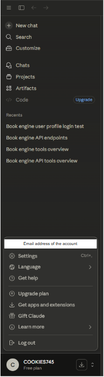 
5. Then click on the settings and go to the developer section and click on the `Edit Config` Button.
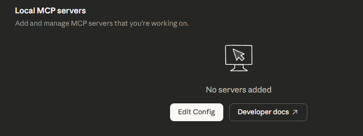
6. This opens up your file explorer that highlights a file called `claude_desktop_config` it is a .json file. Open the file in your prefered IDE.
7. Then attach this line of code to the .json file. 
```"mcpServers": {
    "book-engine": {
      "command": "npx",
      "args": [
        "mcp-remote",
        "https://joshualim-webservicesandwebdata.onrender.com/mcp"
      ]
    }
  }
```

8. Once that is done your config file should look like this. 
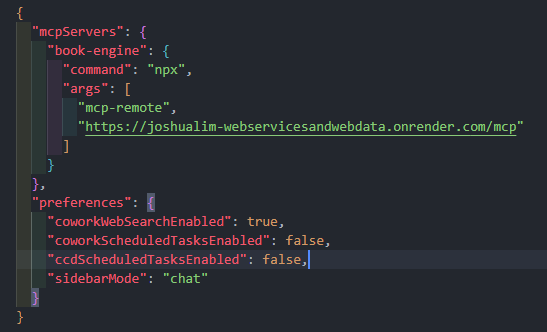
9. Now force close the Claude dekstop with task manager.
10. Open up Claude dekstop, go to the settings and select the developer section. Now we can see that Claude has connected to the API.
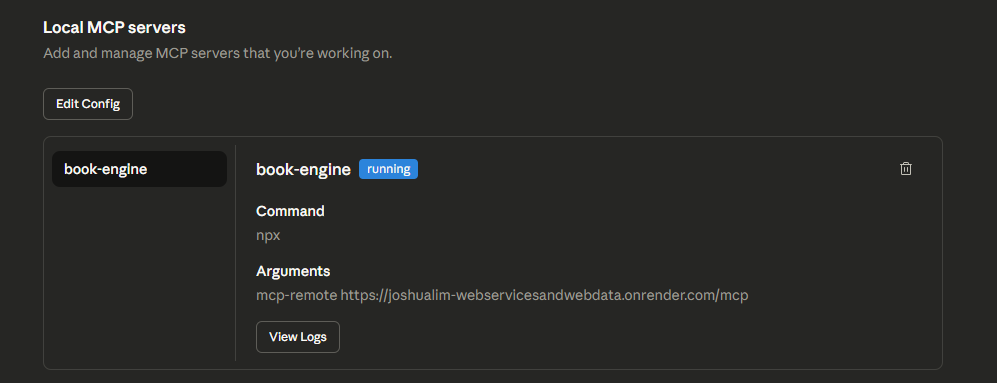
11. Back to the main page, we need to check the connectors. Clicking on the plus icon and hovering over connectors will show that book-engine has been connected. 
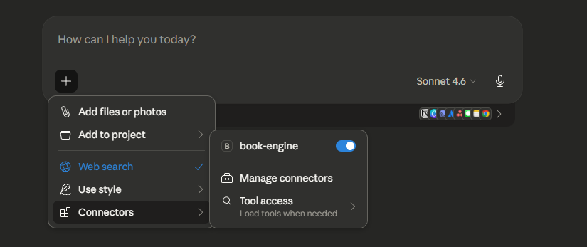
12. Now we can use Claude dekstop to query / use the API endpoints. [Like in this chat](https://claude.ai/share/a4d39020-02a2-4148-ad81-3e8afd118740)

There are cases when Claude asks for permission to use an API endpoints like:
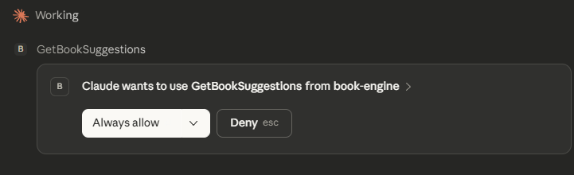 Just click `always allow` or click the down arrow for a drop down to allow only for that query. 


### To interact with your API, you can utilize two online interfaces for testing:

**Online Method 1**: Swagger UI - More for testing Logic 
This is best for manual verification of endpoints and data schemas
URL - [Swagger UI created documentation of my API](https://joshualim-webservicesandwebdata.onrender.com/docs)
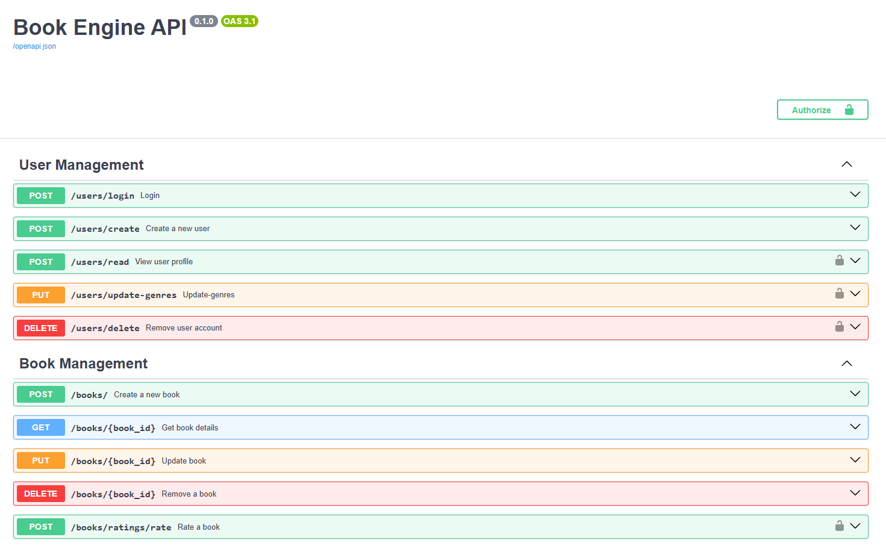

If the server is currently sleeping this is what the webpage will look like. If this is the case just wait for the server to wake up and it will show the docs. 
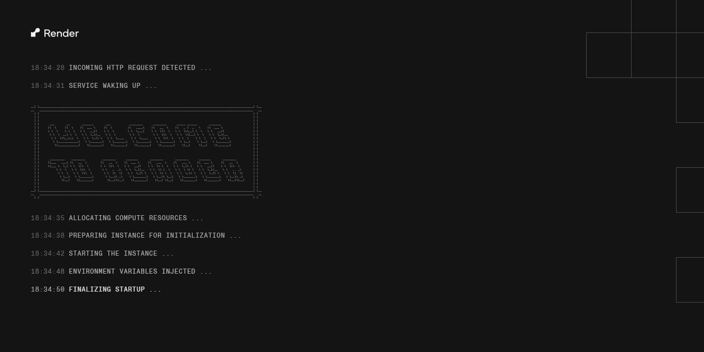
**Online Method 2**: Model Context Protocol (MCP) Inspector - AI integration
a. In your terminal run 

`npx @modelcontextprotocol/inspector https://joshualim-webservicesandwebdata.onrender.com/mcp`


This should run and open a website in your browser. 
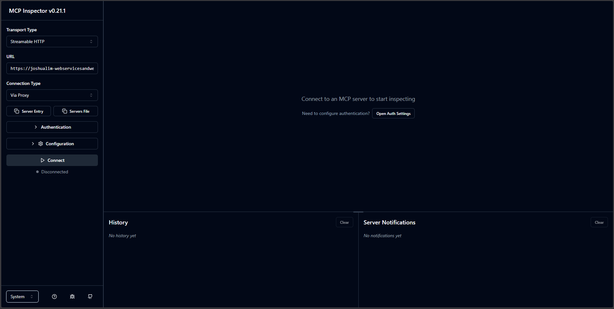
The image above shows the starting page of the inspector


There are several things to check here. 
* Transport Type is set to Streamable HTTP.
* The URL has to be set to https://joshualim-webservicesandwebdata.onrender.com/mcp
* Clicking on the Authentication button list the image below will cause a dropbox to appear.
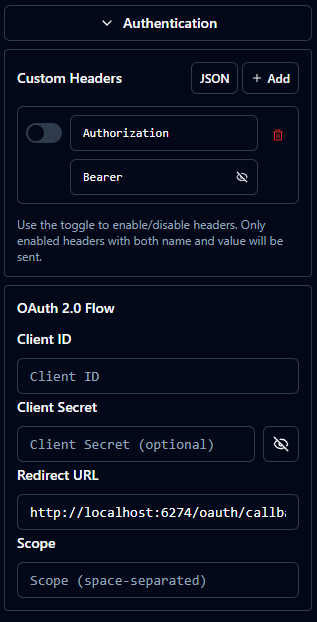
* In the "Custom Header" section we can see 2 boxes to fill in. If it there are no custom headers configured like in the image above 

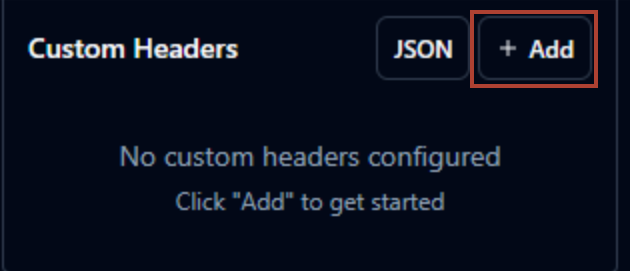.
Please click on the button that has been highlighted red
* Now in the Custom Headers section, in the first box we write in `Authorization` and the second box we write `bearer YOUR_AUTH_TOKEN_HERE`. `YOUR_AUTH_TOKEN` can be obtain in 2 ways which can be seen below. 

#### Method 1
a. Open the [link to my API docs](https://joshualim-webservicesandwebdata.onrender.com/docs#/User%20Management/login_users_login_post) and enter in your user email and password in the appropriate field. 
b. Then execute the code.
c. In the return statement we can see the access_token and token_type.
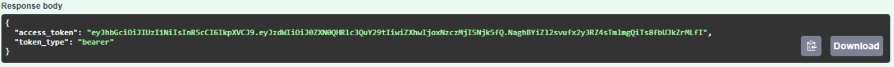
The image above shows an example access_token 

#### Method 2 (PowerShell)
**Note:** This was run on a Windows OS. If you encounter issues on Linux/Mac, please use Method 1.

```powershell
$body = @{
    username = "YourEmail@example.com"
    password = "YourPassword"
}

Invoke-RestMethod -Uri "[https://joshualim-webservicesandwebdata.onrender.com/users/login](https://joshualim-webservicesandwebdata.onrender.com/users/login)" -Method Post -Body $body
```

**NOTE** - The access_token only lasts for 30 mins so  another token has to be obtained after this time period.

d. After obtaining the access_token we can go back to the MCP Inspector and place it in to the second box. In the format of `bearer YOUR_AUTH_TOKEN_HERE`. 

This is what the custom Header should look after filling it in. Do note that on the left of the Authorization is a switch. Please ensure that the switch is turned on like in the image below. 
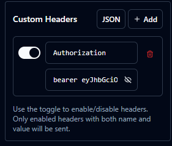

e. Once flling it in, we can now click on the connect button (highlighted orange) at the bottom. 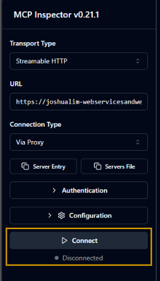.

The grey disconnected button will turn green and say connected if there were no issues that arise. It will turn red of there is an issue. 

If there is an issue it will look like this:
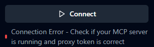
In this case the issue is caused by the web service being set to sleep. So please just wait for the server to wake up. 

If there were no issues and the light is green it will look like this:
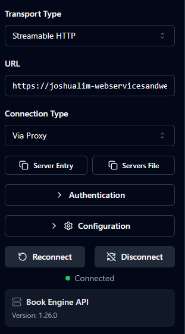

f. Now we are connected to the MCP Inspector. The right hand side of the MCP Inspector updates to look like the image below. 
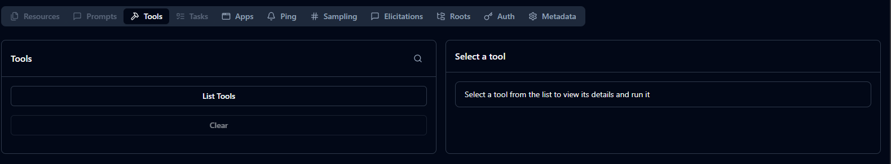

g. Now we just have to click on the list `List Tools` button.
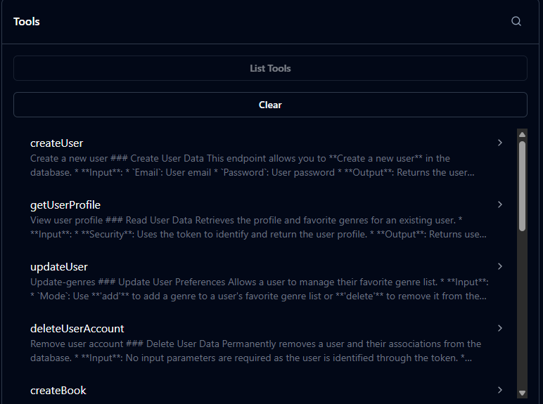
Now we get a dropbox of the all API endpoints provided. Click on one of these tools brings out this information.
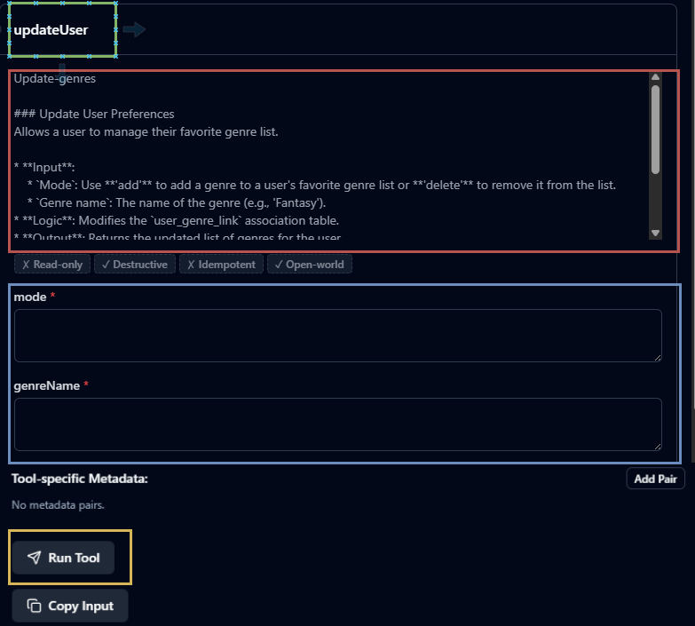

Box Colour Legend
Green - Name of the tool
Red - Description of the tool
Blue - If the tool requires input data this is where you are expected to enter it.
Yellow - After entering the required data, click on this button to run the tool. 

Now you can play around with all the tools. 


If you encounter this error: 
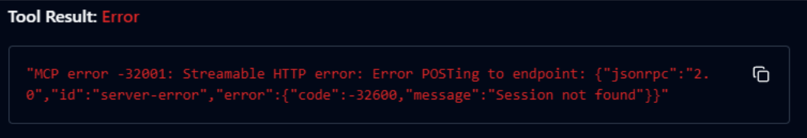

This means that your access_token has expired and you need to get a new one. Look above for the methods to obtain an access_token. Once it has been obtained, go to the custom header and fill in the second box as stated above `bearer REPLACE_ACCESS_TOKEN_HERE`. Once that is done click on the reconnect button and continue with using the tools. 


---

# Extra information
